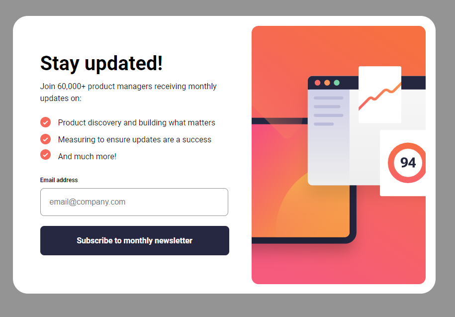
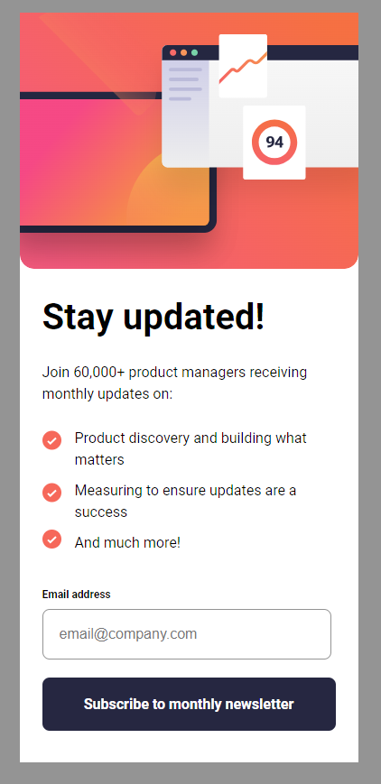

## Table of contents

- [Overview](#overview)
  - [User Story](#user-story)
  - [Screenshot](#screenshot)
  - [Links](#links)
- [My process](#my-process)
  - [Built with](#built-with)
  - [Useful resources](#useful-resources)
- [Author](#author)

## Overview

### User Story

Users should be able to:

- Add their email and submit the form
- See a success message with their email after successfully submitting the form
- See form validation messages if:
  - The field is left empty
  - The email address is not formatted correctly
- View the optimal layout for the interface depending on their device's screen size
- See hover and focus states for all interactive elements on the page

### Screenshot

### Links

- Solution URL: [Github Repo](https://github.com/SteveNoyes/newsletter-sign-up)
- Live Site URL: [Github Pages](https://stevenoyes.github.io/newsletter-sign-up/)

## My process

### Built with

- Semantic HTML5 markup
- CSS custom properties
- Flexbox
- Mobile-first workflow

### Useful resources

- [Reset CSS](https://meyerweb.com/eric/tools/css/reset/) - A Simple reset CSS file from Meyer.
- [Font Creation](https://transfonter.org/) - Creates a set of fonts with TTF, WOFF and WOFF2 fonts.

## Author

- Website - [Steven Noyes](https://www.stevenmnoyes.com)